# Assignment 4: Agent-Based Model Documentation

The agent-based models documented here are based on a research project that explores the bioreceptivity of artificial reefs, focusing on the interactions between marine structures and the small fauna and flora that colonize them. Through computational simulations inspired by agent-based modeling, we investigate how environmental factors, surface geometries, and random movements of small marine organisms influence the development of bioreceptive patterns over time.

The first program simulates agents traversing complex surfaces, mimicking the movements of marine organisms as they explore and attach to the reef structure. The second program models the gradual transformation of these surfaces, translating ecological interactions into proportional movements that shape the reef's micro-topography. The third program integrates toolpath-like milling strategies, representing the biological and physical forces eroding or modifying the reef's surfaces. Together, these simulations provide a framework to analyze and predict the dynamic relationship between artificial reef structures and their colonizing biota, aiding the design of reefs that foster enhanced ecological integration and bioreceptivity in marine environments.

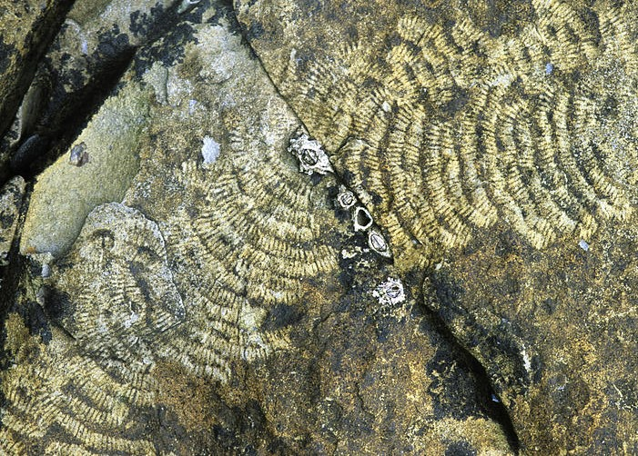

## Table of Contents

- [Pseudo-Code](#pseudo-code)
- [Technical Explanation](#technical-explanation)
- [Design Variations](#design-variations)
- [Challenges and Solutions](#challenges-and-solutions)
- [References](#references)

---

## Pseudo-Code

### Walker Agent:

1. **Main Simulation Loop**:
  - Initialize Walker object with surface.
  - Loop through time steps:
      - Call step() method to update walker's position.
      - Append updated position (point) to pList.

2. **Walker Class**:
  - **Attributes**:
    - surface: The surface on which the walker moves.
    - u, v: Parameters representing the walker's current position on the surface.
  - **Methods**:
    **__init__(surface)**:
      - Get surface domains (u and v).
      - Set initial walker position to the center of the surface.
    **step()**:
      - Adjust u and v randomly within their respective domains.
    **point()**:
      - Evaluate the surface at the walker’s (u, v) parameters to get the corresponding 3D point.

3. **Main Process**:
  - Initialize walker on surface.
  - Loop through each time step:
  - Update walker's position.
  - Add the new position to a list of points.
  - Output the list of points to visualize the random walk.

### Point gradual translator:

1. **Main Process**

  - **Initialize Input Data**:
      Receive a list of points, start_z, and end_z as inputs.
  - **Coerce Points**:
    Ensure that all points are valid 3D points by coercing them into valid geometry.
    If a point is invalid, print an error message and skip it.
  - **Check Point Validity**:
    Ensure there are at least two valid points in the list.
    If not, raise an error (ValueError) indicating that at least two valid points are needed.
  - **Calculate Proportional Z-Translation**:
    For each point, calculate the proportional Z-axis translation based on the input start_z and end_z.
    The first point will have the largest Z translation (based on start_z), and the last point will have the smallest Z translation (based on end_z).
  - **Move Points**:
    For each valid point, apply the proportional Z translation calculated in the previous step.
    Store the moved points in a list.
  - **Return Moved Points**:
    Output the list of moved points as the result.

2. **Helper Functions and Flow**
  - **move_points_z Method**:
    **Inputs**:
    - points: List of 3D points to be moved.
    - start_z: Starting Z value (largest Z translation).
    - end_z: Ending Z value (smallest Z translation).
    **Outputs**:
      A list of moved points after applying the proportional Z translation.
    **Steps**:
      Loop through each point in the input list:
      - Coerce the Point: Ensure the point is valid in 3D space.
      - Check Validity: Ensure there are at least two valid points.
      - Calculate Proportional Movement: For each point in the list, calculate its Z translation based on its position in the list (more distant points move further).
      - Move the Points: Apply the calculated Z translation to each point and store the results.
      - Return the moved points.

3. **Error Handling**
    If the input points is not a list or contains fewer than two valid points, print an error message and return an empty list.
 
### Milling Program:

1. **Main Milling Process**

  - **Initialize Milling Tool (Agent)**:
    - Create an instance of the Agent class with tool radius and height.
  - **Create Toolpath**:
    - Divide the toolpath curve into discrete points (e.g., 100 segments).
  - **Milling Loop**:
    For each point in the toolpath:
      - Move Tool (Agent):
        - Move the milling tool (agent) to the current point on the toolpath.
      - Subtract Material:
        - Perform a boolean difference operation to subtract the milling tool (cylinder) from the block geometry.
  - **Final Output**:
    Output the final geometry after milling.

2. **Agent Class**

  **Attributes**:
    - **tool_radius**: The radius of the milling tool (cylinder radius).
    - **tool_height**: The height (depth) of the milling tool (cylinder height).
    - **tool**: The milling tool represented as a cylinder (created using the radius and height).
  **Methods**:
  - **move_to(point)**: 
    - Moves the milling tool (agent) to a specified point along the toolpath.
    - Translates the tool to the point's position in 3D space.
  - **generate_tool()**:
    - Generates the milling tool (cylinder) at a specific position and returns it as a Brep (solid geometry).

3. **Main Steps**

  **Inputs**:
    - block_geometry: The original geometry of the block to be milled (BRep).
    - toolpath_curve: The curve along which the tool will move (Curve).
    - tool_radius_value: The radius of the milling tool.
    - tool_height_value: The height of the milling tool.
  - **Create Milling Tool**:
    Initialize an Agent object with the given tool_radius_value and tool_height_value.
  - **Create Toolpath Points**:
    Divide the toolpath curve into multiple points for the tool to follow (e.g., 100 points).
  - **Loop Through Toolpath**:
   - For each point in the toolpath:
     - Move the tool (agent) to the current point.
     - Subtract the tool (milling tool) from the block geometry using a boolean difference operation.
  - **Output**:
    Return the resulting geometry after the milling operation.

4. **Final Result**

  **Result Block**:
  The modified block geometry after all milling steps have been performed, representing the final output after subtracting material along the toolpath.

---

## Technical Explanation

**Program 1: Walker Agent on Surface**
- **Object-Oriented Design**
    - **Classes**: The Walker class models an agent moving across a surface. It encapsulates properties like its position (u, v parameters) and behavior (step method for movement).
    - **OOP Principles**:
      - **Encapsulation**: The agent's position and surface are managed internally within the class.
      - **Modularity**: Each walker instance operates independently, promoting code reuse and scalability.
    - **Class Interaction**: The Walker interacts with the surface geometry by evaluating points and updating its position within the surface's parameter space.
- **Agent Behaviors and Interactions**
    - **Behavior Rules**: The agent takes random steps within defined bounds, mimicking exploratory movement.
    - **Environment Interaction**: The agent stays constrained within the surface's domains, ensuring biologically plausible navigation.
    - **Algorithms**: The agent’s movement relies on bounded random number generation for both the u and v parameters.
- **Simulation Loop**
    - **Evolution**: At each time step, the agent moves randomly, updating its position on the surface.
    - **Iteration**: The simulation iterates through a predefined number of steps, storing each new position.
    - **Performance**: Lightweight random sampling and simple position updates make the simulation efficient.
- **Visualization**
    - **Output**: A list of 3D points representing the agent’s path is generated.
    - **Techniques**: The points are visualized in Rhino as individual objects, showing the cumulative movement of the agent over time.

**Program 2: Proportional Z-Movement of Points**
- **Object-Oriented Design**
  - **Classes**: This program processes points directly without explicit OOP constructs. Each point behaves as an implicit "agent."
  - **OOP Principles**: Encapsulation is implicit in the function’s structure, where input points are processed and returned as transformed entities.
  - **Interaction**: The function treats the points as a cohesive dataset, applying transformations independently to each based on its position in the list.
- **Agent Behaviors and Interactions**
  - **Behavior Rules**: Points are moved proportionally along the Z-axis, with the first point experiencing the largest shift and the last experiencing the smallest.
  - **Environment Interaction**: The transformation is predefined and does not depend on external conditions.
  - **Algorithms**: Linear interpolation determines the Z-movement for each point, ensuring a smooth gradation.
- **Simulation Loop**
  - **Evolution**: Each point in the input list is processed sequentially.
  - **Iteration**: The transformation is applied once, making this a single-step operation.
  - **Performance**: Efficient list processing ensures rapid computation for large datasets.
- **Visualization**
  - **Output**: A modified list of points is returned, representing the new positions.
  - **Techniques**: Transformed points are visualized in Rhino to illustrate the gradated vertical displacement.

**Program 3: Simulated Milling of Surfaces**
- **Object-Oriented Design**
  - **Classes:** 
    - Explicit class structures are not used, but geometric entities like Cylinder and Brep from Rhino.Geometry act as modular components.
    - The milling tool behaves as an implicit "agent."
  - **OOP Principles**: Encapsulation is achieved through Rhino.Geometry objects, and modularity allows flexibility in modifying the tool or block properties.
  - **Interaction**: The tool interacts with the block by performing Boolean difference operations at each step.
- **Agent Behaviors and Interactions**
  - **Behavior Rules**: The tool follows a predefined path and removes material from the block at each step.
  - **Environment Interaction**: The toolpath curve dictates the tool’s position, influencing where material is removed.
  - **Algorithms**: Boolean difference operations handle the material subtraction, while transformations position the tool along the path.
- **Simulation Loop**
  - **Evolution**: The tool moves along the curve, interacting with the block geometry at discrete points.
  - **Iteration**: The loop progresses through sampled points on the toolpath curve, transforming the tool and updating the block geometry at each step.
  - **Performance**: Boolean operations are computationally intensive, requiring careful handling of geometry complexity.
- **Visualization**
  - **Output**: The resulting block geometry, shaped by the milling process, is the final output.
  - **Techniques**: Rhino's 3D visualization tools display the modified geometry, illustrating the effects of the simulated milling.

---

## Design Variations

*(Include images and descriptions of your generated design variations. For each variation, discuss the parameters or rules changed and the impact on the resulting patterns.)*

### Variation Examples

1. **Variation 1: [Name/Description]**

   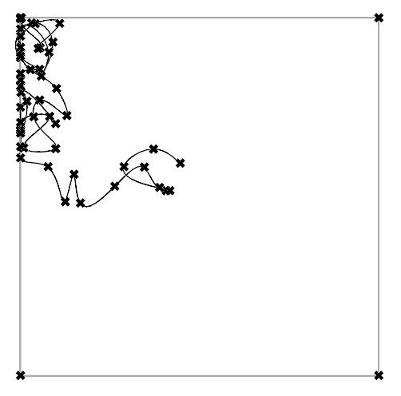

   - **Parameters Changed**:
     - seed: [8]
     - time: [50]
   - **Description**:
     - Describe how these changes affected agent behaviors and the final pattern.

2. **Variation 2: [Name/Description]**

   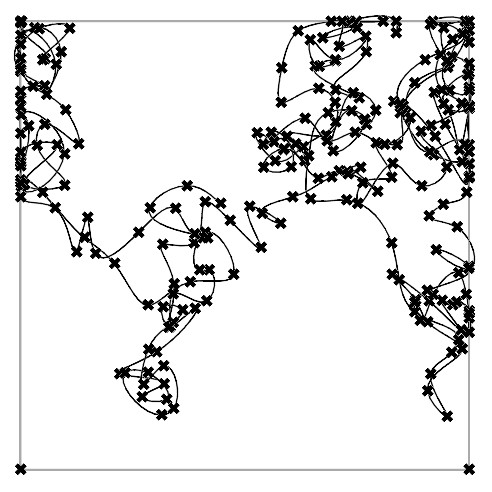

   - **Parameters Changed**:
     - seed: [8]
     - time: [250]
   - **Description**:
     - Explain how the introduction of randomness or environmental factors impacted the results.

3. **Variation 3: [Name/Description]**

   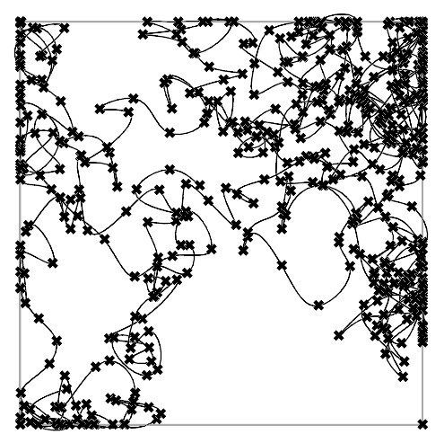

   - **Parameters Changed**:
     - seed: [8]
     - time: [500]
   - **Description**:
     - Explain how the introduction of randomness or environmental factors impacted the results.

4. **Variation 4: [Name/Description]**

   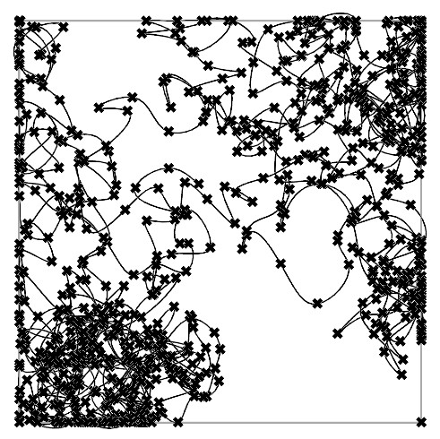

   - **Parameters Changed**:
     - seed: [8]
     - time: [750]
   - **Description**:
     - Discuss the observed changes in the model.

5. **Variation 5: [Name/Description]**

   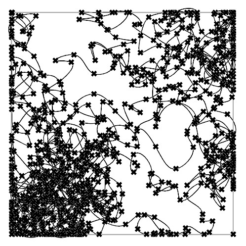

   - **Parameters Changed**:
     - seed: [8]
     - time: [1000]
   - **Description**:
     - Explain how the introduction of randomness or environmental factors impacted the results.

6. **Variation 6: [Name/Description]**

   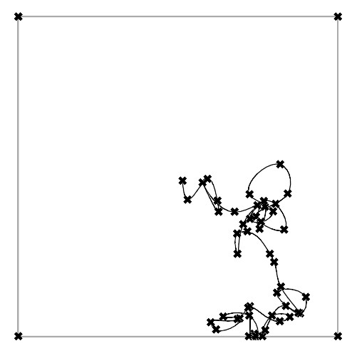

   - **Parameters Changed**:
     - seed: [10]
     - time: [50]
   - **Description**:
     - Explain how the introduction of randomness or environmental factors impacted the results.

7. **Variation 7: [Name/Description]**

   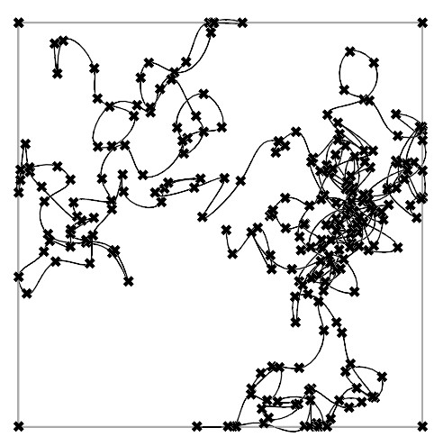

   - **Parameters Changed**:
     - seed: [10]
     - time: [250]
   - **Description**:
     - Explain how the introduction of randomness or environmental factors impacted the results.

8. **Variation 8: [Name/Description]**

   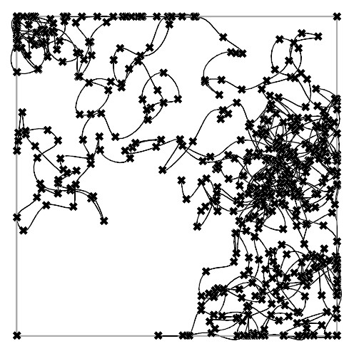

   - **Parameters Changed**:
     - seed: [10]
     - time: [500]
   - **Description**:
     - Explain how the introduction of randomness or environmental factors impacted the results.

9. **Variation 9: [Name/Description]**

   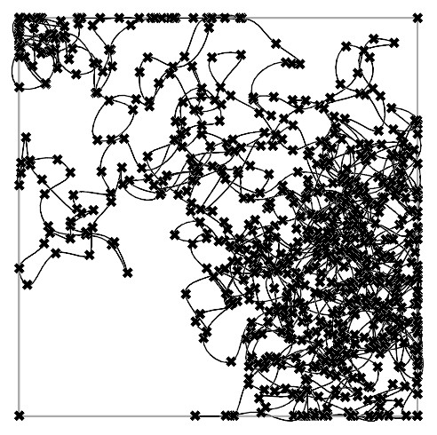

   - **Parameters Changed**:
     - seed: [10]
     - time: [750]
   - **Description**:
     - Explain how the introduction of randomness or environmental factors impacted the results.

10. **Variation 10: [Name/Description]**

   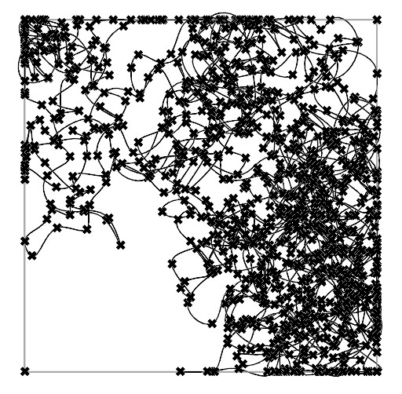

   - **Parameters Changed**:
     - seed: [10]
     - time: [1000]
   - **Description**:
     - Explain how the introduction of randomness or environmental factors impacted the results.

---

## Challenges and Solutions

1. **Confining Agent Movements to Surface Domains**
- **Challenge**: Ensuring agents moved within the valid parameter range of a surface without exceeding its bounds.
- **Solution**: Adjusted movement logic to dynamically check and constrain parameter updates based on the surface's domain values, addressing errors encountered during testing.

2. **Improving Computational Efficiency in Geometry Operations**
- **Challenge**: Boolean and transformation operations on complex geometries were computationally expensive and error-prone.
- **Solution**: Streamlined the use of Rhino.Geometry methods, such as ensuring proper transformations and efficient combination of geometry operations to reduce processing time.

3. **Resolving Type-Related Errors in Rhino API Functions**
- **Challenge**: Frequent mismatches between data types expected by Rhino functions (e.g., handling of lists, vectors, and Breps).
- **Solution**: Debugged and refined type handling, including corrections to Brep.CreateBooleanDifference and PointAdd operations, to align with the API's requirements.

4. **Validating and Transforming Input Data**
- **Challenge**: Ensuring that inputs (e.g., point lists, surfaces, and toolpath data) were in the correct format and handled inconsistencies in provided data.
- **Solution**: Introduced input validation processes and error handling mechanisms to detect and address invalid or incomplete data before processing.

5. **Managing Visualization of Agent Movements and Results**
- **Challenge**: Errors occurred in visualizing dynamic agent paths and geometry transformations, leading to incomplete or incorrect outputs.
- **Solution**: Refined visualization methods, including point generation and geometric transformations, to accurately represent iterative processes and final results.

---

## References

*(List any resources you used or found helpful during the assignment.)*

- **Object-Oriented Programming**

  - [Python Official Documentation](https://docs.python.org/3/tutorial/classes.html)
  - [Real Python - OOP in Python](https://realpython.com/python3-object-oriented-programming/)

- **Agent-Based Modeling**

  - [Mesa: Agent-Based Modeling in Python](https://mesa.readthedocs.io/en/master/)
  - [Agent-Based Models in Architecture](https://www.researchgate.net/publication/279218265_Agent-based_models_in_architecture_new_possibilities_of_interscalar_design)
  - [Walker agent](https://natureofcode.com/book/chapter-7-cellular-automata/#randomwalks)
  - [Walker agent forum](https://www.grasshopper3d.com/forum/topics/random-walk-scripting)
  - [Random Walks in Programming](https://thecodingtrain.com/beginners/p5js/8.1-random-walk.html)
  - [Geometry Transformations](https://developer.rhino3d.com/guides/rhinopython/geometry-transformations/)

- **Visualization Tools**

  - [Rhino.Python Guides](https://developer.rhino3d.com/guides/rhinopython/)

---

*(Feel free to expand upon these sections to fully capture your work and learning process.)*

---